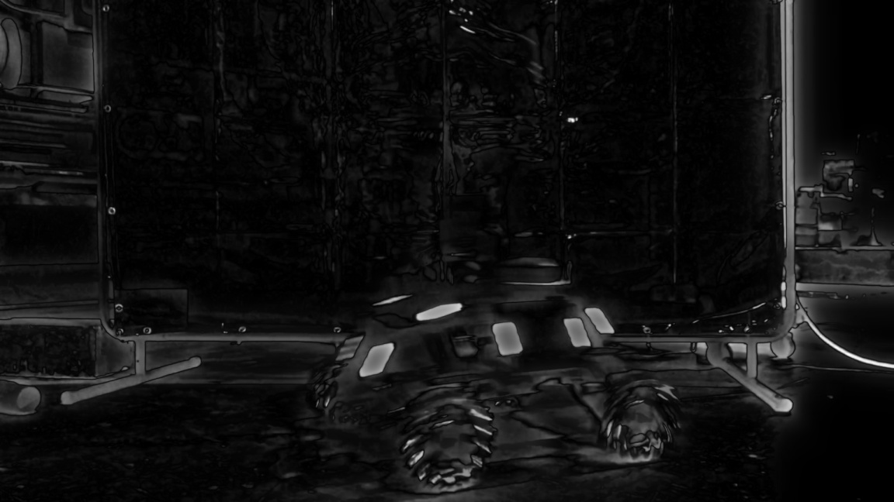
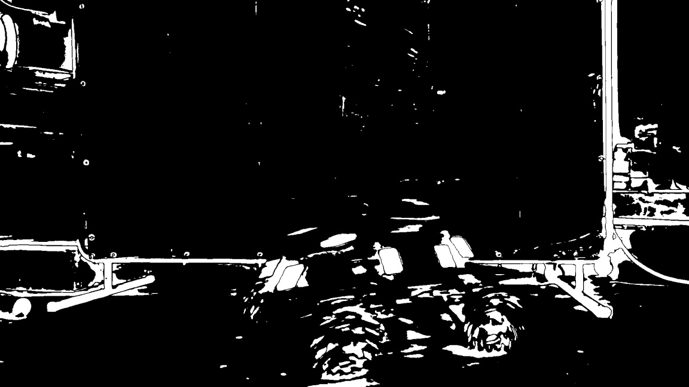

# Saliency Detection
Saliency is the process of locating important parts of an image. It is extremely fast compared to larger detection algorithms. To increase frame rate, it might be worth considering passing a frame initially through a saliency detector, and then apply detection algorithms on the regions of interest.

Using openCV's saliency module, we can use a static saliency detection algorithm on an image

   
  

if we would like a *binary* map that we could process for contours, extract bounding boxes, etc., we can additionally threshold the saliency map

   
  

